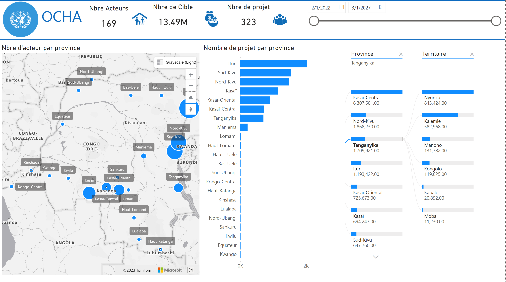

# OCHA
The Office for the Coordination of Humanitarian Affairs (OCHA) in the Democratic Republic of the Congo (DRC) is responsible for coordinating the humanitarian response to crises and emergencies in the country. The DRC has been affected by a complex humanitarian crisis for several years due to conflict, displacement, and epidemics, which has led to widespread human suffering.

OCHA's main goal in the DRC is to ensure that all those in need of assistance receive it. This involves coordinating with various humanitarian organizations, including the United Nations, NGOs, and local partners, to provide aid and support to vulnerable populations.

Some of the ongoing projects and initiatives led by OCHA in the DRC include:

1. Providing emergency assistance: OCHA works to provide emergency assistance to people affected by conflict and displacement, including food, water, shelter, and medical care.

2. Coordinating humanitarian response: OCHA leads the coordination of the humanitarian response in the DRC, bringing together various humanitarian actors to ensure a comprehensive and effective response.

3. Protection of civilians: OCHA works to protect civilians affected by the conflict and displacement, including women, children, and other vulnerable populations.
 
4. Disease prevention and control: OCHA works with the World Health Organization (WHO) and other partners to prevent and control the spread of diseases like Ebola and COVID-19.

5. Supporting the most vulnerable: OCHA works to support the most vulnerable populations in the DRC, including refugees, internally displaced persons, and host communities.

# Power BI 
Power BI can be a powerful tool in the context of humanitarian work, where organizations often have to make critical decisions based on complex data sets. By using Power BI, humanitarian organizations can gain insights into their programs and activities, and better understand the impact of their interventions.

Some specific applications of Power BI in humanitarian work include:

1. Monitoring and evaluation: Power BI can be used to track and analyze key performance indicators (KPIs) for humanitarian programs. By visualizing data in real-time, organizations can quickly identify trends and adjust their programs accordingly.

2. Resource allocation: Power BI can help humanitarian organizations optimize the allocation of their resources, such as funds, personnel, and supplies. By analyzing data on needs and demand, organizations can prioritize their interventions and ensure that resources are allocated effectively.

3. Communication and reporting: Power BI can be used to create interactive dashboards and reports that can be shared with donors, partners, and other stakeholders. By presenting data in a clear and compelling way, organizations can communicate their impact and build support for their work.

# United Nation Report OCHA DRC
Our project focuses on developing a report on the number of humanitarian projects in the DRC, their distribution across provinces and sectors, as well as the number of targets and actors by province, project, and sector. We collected the necessary data from the OCHA website, a reliable source of information on humanitarian projects worldwide.

To analyze the data, we used Power BI, a powerful data analytics and visualization tool. By leveraging Power BI's capabilities, we were able to create interactive visualizations that highlight trends and patterns in the data, helping us gain valuable insights into the state of humanitarian projects in the DRC.

Through our analysis, we were able to identify the provinces and sectors with the greatest need for humanitarian assistance. We also explored correlations between different variables, such as the number of projects and population size, providing a more nuanced understanding of the situation.

Our report has the potential to inform decision-making by organizations and individuals working in the field, helping them allocate resources more effectively and efficiently. Overall, this project has the potential to make a meaningful impact on the lives of those affected by humanitarian crises in the DRC.

## Dashboard
Our dashboard provides a comprehensive overview of the humanitarian situation in the DRC, focusing on the number of actors, targets, and projects working to alleviate humanitarian crises. Using Power BI, we have created interactive visualizations that help to illustrate the data in an informative and user-friendly way.

One of the key features of our dashboard is a map of the DRC that shows the number of actors working on humanitarian projects in each province. This visualization provides a high-level overview of the distribution of actors, allowing users to identify areas that may require additional support.

We also included visualizations that display the number of projects by province. This helps users to understand where the most support is being directed and which areas may be under-resourced. These visualizations can help organizations and individuals to make more informed decisions about where to allocate resources and focus their efforts.

To provide a more detailed view of the data, we have included a decomposition tree for targets by province and territory. This allows users to drill down into the specific targets being addressed by humanitarian projects in each province and territory, providing valuable insights into the types of assistance being provided.

The dashboard is a useful tool for organizations and individuals working in the field of humanitarian assistance in the DRC. By providing a comprehensive and interactive view of the data, it can help users to make more informed decisions about where to focus their efforts and allocate resources, ultimately making a positive impact on the lives of those affected by humanitarian crises in the country.

## Report 
The second section provides more detailed information on cluster and target, focusing on the number of projects with actors by cluster of project, as well as the province with the target. These visualizations give users a deeper understanding of the types of projects being carried out, the actors involved, and the locations where they are taking place.

The visualization that displays the number of projects with actors by cluster of project is a useful tool for identifying which clusters are receiving the most support. This information can help organizations and individuals to make informed decisions about where to allocate resources and where more assistance may be needed.

The province with target information is also valuable, as it helps users to understand where the assistance is being directed and which areas may require additional support. This information can help organizations and individuals to make more informed decisions about where to focus their efforts and allocate resources.

## Key Influencer 
The key influencer analysis section is designed to help users understand the factors that are contributing to changes in target numbers for humanitarian projects in the DRC. By analyzing various fields such as name of actors, name of clusters, and name of projects, the analysis identifies which factors are having the greatest impact on target numbers.

This analysis provides valuable insights into the complex factors that contribute to the success of humanitarian projects in the DRC. For example, it may reveal that certain actors or clusters are particularly effective in achieving targets, or that certain projects are more successful than others.

By identifying which factors are driving changes in target numbers, users can make more informed decisions about where to focus their efforts and allocate resources. This can help organizations and individuals to be more effective in their work and make a positive impact on the lives of those affected by humanitarian crises in the country.

## Projects Details 
This section provides valuable insights into the characteristics of NGOs operating in the DRC and their contributions to humanitarian projects in the country. By breaking down the data by international and national NGOs, users can gain a better understanding of the different types of organizations working in the region and the different approaches they may take.

The analysis of project counts that remained constant between February 2022 and March 2027 is also an important tool for understanding the state of humanitarian projects in the DRC over time. By identifying which projects remained constant during this period, users can gain insights into which projects are most stable and have the greatest potential for long-term success.

The third section provides valuable insights into the characteristics of NGOs operating in the DRC and the state of humanitarian projects in the country over time. By breaking down the data by international and national NGOs and analyzing project counts over time, users can gain a more nuanced understanding of the humanitarian situation in the country and make more informed decisions about where to focus their efforts and allocate resources.

## Link to the dashboard
[United Nation ](https://app.powerbi.com/view?r=eyJrIjoiY2Q1ZTBmOTctYzJkZC00YWJhLWFiNjgtYzVkZGJmMGUyOTgyIiwidCI6ImQyMzViNDFjLTVlZTktNGM2MC1iY2ZmLWQ2OGZlM2JmZjZhMCIsImMiOjN9)
